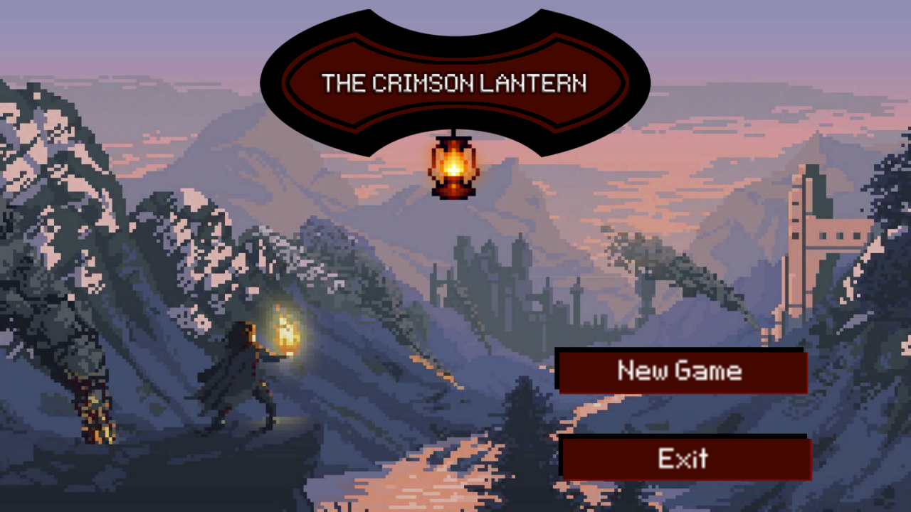

# Crimson-lantern

## Description
Crimson Lantern is a dark fantasy survival card game made with Unity. The project was created during 24h game jam held at University of Lodz's Faculty of Physics & Computer Science. 

## The *SigmasBetas* team 
- [Mateusz](https://github.com/MateuszPieczynski2000) the Undoubtful, 
- [Michał](https://github.com/petpet666) the Vivacious,
- [Karol](Sandpitturtleee) the Relentless,
- [Myself](https://github.com/NakerTheFirst) the Adjectiveless

## Lore
Unsettled by dark tales surrounding the city, you come to Emberhorn fleeing from the turmoils of the past. The mistakes you've made forced your banishment to the Forbidden Lands, where voidlings & darklings lurk around every corner. The only trail of hope the city has is centred around its sacred artifact - the Crimson Lantern. It provides cover from the Darkness - an evergrowing sinister force absorbing everything the people hold onto: desires, hopes & dreams. The Lantern can be powered by rare Blood Crystals, which can be obtained only from the creatures of the Darkness. As the Emberhorn's governor, it is your duty to assemble a team of adventurers who will risk their lives hunting down the most frightening horrors humanity could ever imagine. 

## Live demo
The project is hosted live [here](https://nakerthefirst.github.io/Crimson-lantern/)

## Screenshots

